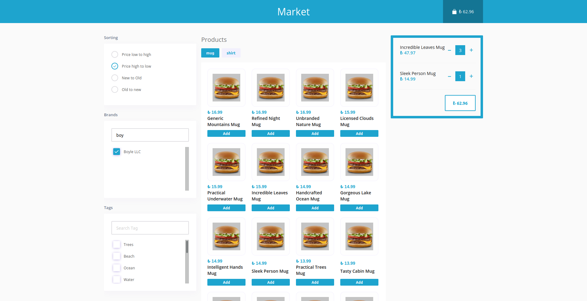
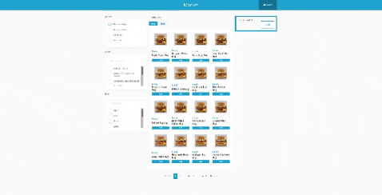
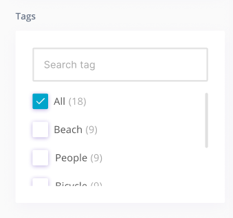

# Market App
This project is like an e-commerce frontend page. You can filter the products and add them to the basket. Finally you can buy.

## Demo


## Features
- Fetch Data from API
- Product Filtering
- Add to Basket
- You can change the number of items in the basket
- You can view the products page by page

## Used

- React
- Redux
- Styled Components
- Cypress
- [react-toastify](https://fkhadra.github.io/react-toastify/introduction/)
- [react-paginate](https://www.npmjs.com/package/react-paginate)
- [json-server](https://github.com/typicode/json-server) 

## Setup
```
git clone https://github.com/Cihatata/marketApp.git
cd marketApp
npm install
npm run dev
```

## Test
```
npm run cypress:headless
npm run cypress
```

## Comment
I reviewed the GetirYemek home page before starting the project. I analyzed the rest api requests. Firstly I coded UI components with styled-components. Then I managed states with redux. I fetched data and stored data in Redux state. I managed data using Redux hooks. I refactored after I finished the project. You can see in my old commits. I wrote a test with cypress for the first time.

There was a point where I got stuck. To access the number of array elements in the filter(image in below), I will fetch all elements from the API then count all element before the page was loaded. This process would be costly. I reiviewed getiryemek. This data server side rendering in Getiryemek. I created static file. I wrote the data myself (services/tags.js and services/brands.js)

<br>



I wrote Readmd other directory.
<br>
I hope you will like it :)